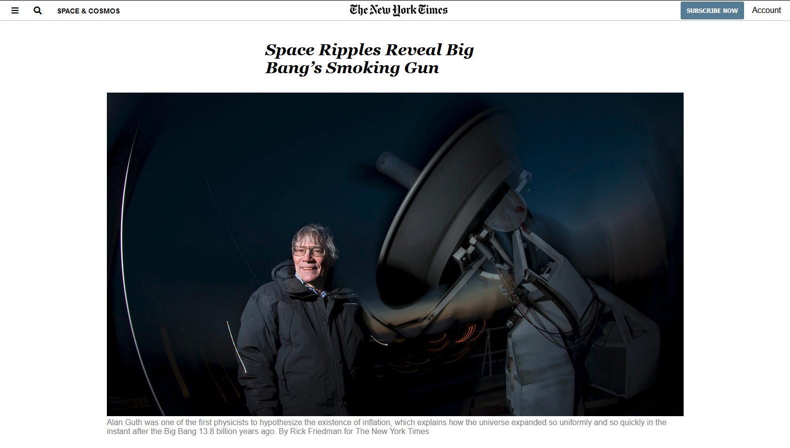

# New York Times Article

> Using the New York Times website we created a site using HTML and CSS and worked based on an article selected. This article specifically lead us to learn more about grids and positioning.

We created a project based on a New York Times Article. The article had many grids which lead us to learn and use CSS grids and positioning. It have a nav bar and also includes the same article information we used as well as a video. We also included the footer.

## Built With

- HTML5
- CSS3

## Live Demo

[Live Demo Link](https://rawcdn.githack.com/jcy2704/NYT-CSS/fd5bcea9dfc9bb0f96a26b08aee15b398c257a8c/index.html)

## Getting Started

**This project was created for the sole purpose of learning how to use CSS grid, positioning and flex. The following will be instructions on how you can see the project on your own computer.**

To get a local copy up and running follow these simple example steps.

### Prerequisites
Computer running Mac OS, Windows, or Linux Ubuntu.
Internet browser: Firefox, Google Chrome, Opera...

### Setup
Download the code or copy the git repository to your computer.

### Usage
Run the index.html file.

### Run tests
Linters errors

## Authors

👤 **Steven Jack Chung**

- GitHub: [@jcy2704](https://github.com/jcy2704)
- Twitter: [@yiak_](https://twitter.com/yiak_)
- LinkedIn: [Steven Jack Chung](https://linkedin.com/in/stevenjchung)

👤 **Mir Rawshan Ali**

- GitHub: [@sumon0002009](https://github.com/sumon0002001)
- Twitter: [@sumon0002009](https://twitter.com/Sumon0002009)
- LinkedIn: [Mir Rawshan Ali](https://www.linkedin.com/in/mir-rawshan-ali-27b6a5198/)

## 🤝 Contributing

Contributions, issues, and feature requests are welcome!

Feel free to check the [issues page](https://github.com/jcy2704/NYT-CSS/issues).

## Show your support

Give a ⭐️ if you like this project!

## Acknowledgments

- Hat tip to anyone whose code was used
- Inspiration
- New York Times
